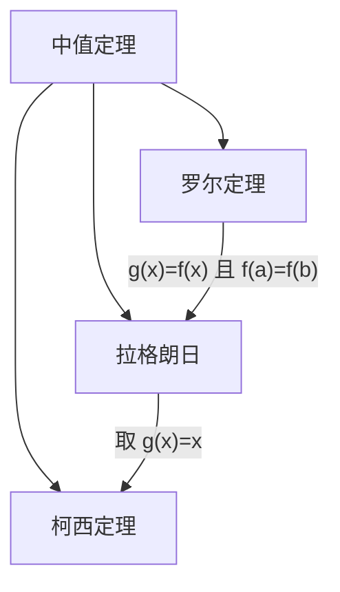

# 一元函数微分学

> **考情提示**：一元微积分是数一高等数学的半壁江山——选择题每年 2–3 题（6–12 分）+ 解答题 1–2 道（约 10–20 分）。中值定理证明题和泰勒公式展开是高分值区分度的核心素材，极值应用题也是常客。

## 导数与微分

### 导数的定义

函数 $f(x)$ 在 $x_0$ 处的导数定义为：

$$
f'(x_0) = \lim_{\Delta x \to 0} \frac{f(x_0 + \Delta x) - f(x_0)}{\Delta x}
       = \lim_{x \to x_0} \frac{f(x) - f(x_0)}{x - x_0}
$$

**可导的充要条件** 🔥：左右导数都存在且相等。即 $f'_-(x_0) = f'_+(x_0)$。可导 $\Rightarrow$ 连续，但连续 $\nRightarrow$ 可导（如 $|x|$ 在 $x=0$ 处连续但不可导）。

**微分的定义**：若函数增量可以表示为 $\Delta y = A \Delta x + o(\Delta x)$，则 $f(x)$ 在 $x_0$ 处可微，且 $dy = f'(x_0) dx$。一元函数中**可导 $\iff$ 可微**。

### 导数计算公式

| 类型 | 方法 | 示例 |
|------|------|------|
| 基本公式 | 直接套用求导公式 | $(x^n)' = nx^{n-1}$、$(e^x)' = e^x$、$(\ln x)' = \frac{1}{x}$、$(\sin x)' = \cos x$ |
| 四则运算 | $(u \pm v)' = u' \pm v'$、$(uv)' = u'v + uv'$、$(\frac{u}{v})' = \frac{u'v - uv'}{v^2}$ | — |
| 复合函数 | 链式法则：$\frac{dy}{dx} = \frac{dy}{du} \cdot \frac{du}{dx}$ | $y = \sin(x^2) \Rightarrow y' = \cos(x^2) \cdot 2x$ |
| 隐函数 | 方程两边同时对 $x$ 求导，含 $y$ 的项用链式法则 $\cdot y'$ | $x^2 + y^2 = 1 \Rightarrow 2x + 2y \cdot y' = 0 \Rightarrow y' = -x/y$ |
| 参数方程 | $x=\varphi(t),\ y=\psi(t) \Rightarrow \frac{dy}{dx} = \frac{\psi'(t)}{\varphi'(t)}$ | — |
| 高阶导数 | 逐次求导；乘积高阶用莱布尼茨公式 | $(uv)^{(n)} = \sum_{k=0}^{n} \binom{n}{k} u^{(n-k)} v^{(k)}$ |
| 对数求导 | 对于幂指函数 $f(x)^{g(x)}$，先取对数再求导 | $y = x^x \Rightarrow \ln y = x \ln x \Rightarrow \frac{y'}{y} = \ln x + 1$ |

### 反函数求导

$$
\frac{dx}{dy} = \frac{1}{\frac{dy}{dx}}, \quad \text{即} \quad [f^{-1}]'(y_0) = \frac{1}{f'(x_0)}
$$

> 反三角函数导数由此推出：$(\arcsin x)' = \frac{1}{\sqrt{1-x^2}}$、$(\arctan x)' = \frac{1}{1+x^2}$

## 微分中值定理

中值定理 🔥 是考研证明题最集中的领域，三定理层层递进：

### 罗尔定理

若 $f(x)$ 在 $[a,b]$ 上连续、$(a,b)$ 内可导，且 $f(a) = f(b)$，则：

$$
\exists \xi \in (a,b), \quad f'(\xi) = 0
$$

**几何意义**：两端点等高的光滑曲线上至少存在一条水平切线。

**典型应用**：证明方程 $f'(x) = 0$ 在区间内有根 $\rightarrow$ 构造原函数在两端点处等值即可得证。

### 拉格朗日中值定理

若 $f(x)$ 在 $[a,b]$ 上连续、$(a,b)$ 内可导，则：

$$
\exists \xi \in (a,b), \quad f'(\xi) = \frac{f(b) - f(a)}{b - a}
$$

**几何意义**：光滑曲线上至少存在一点，其切线平行于连接两端点的割线。

**典型应用**：
- 证明不等式：如 $\frac{b-a}{1+b^2} < \arctan b - \arctan a < \frac{b-a}{1+a^2}$
- 证明函数恒等式：若 $f'(x) \equiv 0$ 则 $f(x) \equiv $ 常数
- 函数单调性判定：$f'(x) > 0 \Rightarrow f$ 严格单调递增

### 柯西中值定理

若 $f(x)$ 和 $g(x)$ 均在 $[a,b]$ 上连续、$(a,b)$ 内可导且 $g'(x) \neq 0$，则：

$$
\exists \xi \in (a,b), \quad \frac{f(b) - f(a)}{g(b) - g(a)} = \frac{f'(\xi)}{g'(\xi)}
$$

> 柯西中值定理是**洛必达法则的底层依据**。常出现在需要同时处理两个函数的证明题中。

## 泰勒公式

### 带拉格朗日余项的泰勒公式

若 $f(x)$ 在 $x_0$ 的某邻域内 $n+1$ 阶可导，则：

$$
f(x) = \sum_{k=0}^{n} \frac{f^{(k)}(x_0)}{k!} (x-x_0)^k + R_n
$$

其中 $R_n = \frac{f^{(n+1)}(\xi)}{(n+1)!} (x-x_0)^{n+1}$，$\xi$ 介于 $x_0$ 与 $x$ 之间。

### 带佩亚诺余项的泰勒公式

$$
f(x) = \sum_{k=0}^{n} \frac{f^{(k)}(x_0)}{k!} (x-x_0)^k + o((x-x_0)^n)
$$

> 🔥 考研极限计算中，**带佩亚诺余项的泰勒展开是终极武器**——当等价无穷小和洛必达都焦头烂额时，泰勒一次压平一切。

### 常用麦克劳林展开式（必背）

麦克劳林公式是 $x_0 = 0$ 时的泰勒公式：

$$
\begin{aligned}
e^x &= 1 + x + \frac{x^2}{2!} + \frac{x^3}{3!} + \cdots + \frac{x^n}{n!} + o(x^n) \\[6pt]
\sin x &= x - \frac{x^3}{3!} + \frac{x^5}{5!} - \frac{x^7}{7!} + \cdots + o(x^{2n+1}) \\[6pt]
\cos x &= 1 - \frac{x^2}{2!} + \frac{x^4}{4!} - \frac{x^6}{6!} + \cdots + o(x^{2n}) \\[6pt]
\ln(1+x) &= x - \frac{x^2}{2} + \frac{x^3}{3} - \frac{x^4}{4} + \cdots + o(x^n) \\[6pt]
(1+x)^\alpha &= 1 + \alpha x + \frac{\alpha(\alpha-1)}{2!} x^2 + \cdots + o(x^n) \\[6pt]
\frac{1}{1-x} &= 1 + x + x^2 + x^3 + \cdots + o(x^n)
\end{aligned}
$$

> **记忆技巧**：$e^x$ 全正项、$\sin x$ 奇次交错、$\cos x$ 偶次交错、$\ln(1+x)$ 正负交替。

## 单调性与极值

### 函数单调性判定

若 $f$ 在 $[a,b]$ 上连续且 $(a,b)$ 内可导：
- $f'(x) > 0 \ \forall x \in (a,b) \Rightarrow f$ 严格单调递增
- $f'(x) < 0 \ \forall x \in (a,b) \Rightarrow f$ 严格单调递减

> 导数为 0 的孤立点不改变单调性方向——如 $f(x) = x^3$ 在 $x=0$ 处 $f'(0)=0$ 但整体仍严格递增。

### 极值的判别

**必要条件** 🔥：若 $f$ 在 $x_0$ 处可导且取得极值，则 $f'(x_0) = 0$（称 $x_0$ 为**驻点**）。但驻点未必是极值点（如 $f(x) = x^3$ 在 $x=0$）。

**第一充分条件**（一阶导数变号）：
- $f'(x)$ 在 $x_0$ 左侧为正、右侧为负 $\Rightarrow$ $f(x_0)$ 是极大值
- $f'(x)$ 在 $x_0$ 左侧为负、右侧为正 $\Rightarrow$ $f(x_0)$ 是极小值

**第二充分条件**（二阶导数判定）：
- $f'(x_0) = 0$ 且 $f''(x_0) < 0 \Rightarrow f(x_0)$ 是极大值
- $f'(x_0) = 0$ 且 $f''(x_0) > 0 \Rightarrow f(x_0)$ 是极小值
- $f'(x_0) = 0$ 且 $f''(x_0) = 0$ $\Rightarrow$ 无法判定，需用第一充分条件或更高阶导数

> 考场论局：首选第二充分条件（算完二阶导立即判断），失败再用一阶导变号法。

### 最值问题

闭区间 $[a,b]$ 上连续函数的最值求法：
1. 求出开区间内所有驻点和不可导点
2. 计算这些点以及两端点处 $f(x)$ 的值
3. 取最大者为最大值，最小者为最小值

实际应用题（如用料最省、面积最大）的步骤：建立目标函数 $\to$ 写出定义域 $\to$ 求导找临界点 $\to$ 代入比较。

### 曲线的凹凸性与拐点

- $f''(x) > 0$ $\Rightarrow$ 曲线**凹**（向上弯，碗状）
- $f''(x) < 0$ $\Rightarrow$ 曲线**凸**（向下弯，倒碗状）
- $f''(x_0) = 0$ 且 $f''$ 在 $x_0$ 两侧变号 $\Rightarrow$ $(x_0, f(x_0))$ 是**拐点**

渐近线三种：
1. **水平渐近线**：$\lim_{x \to \pm\infty} f(x) = c \Rightarrow y = c$
2. **垂直渐近线**：$\lim_{x \to x_0} f(x) = \infty \Rightarrow x = x_0$
3. **斜渐近线**：$\lim_{x \to \infty} \frac{f(x)}{x} = k$ 且 $\lim_{x \to \infty}[f(x)-kx] = b \Rightarrow y = kx + b$

## 常见题型

- **导数定义极限题**：给极限式求 $f'(x_0)$，核心是识别极限式是否可改写为 $\lim_{\Delta x \to 0} \frac{f(x_0+\Delta x)-f(x_0)}{\Delta x}$
- **隐函数/参数方程求导**：注意链式法则每步不要漏项，二阶导尤其易错
- **中值定理证明**（高频难题）：构造辅助函数是关键——如果求证 $g'(\xi)=0$，常用 $g(x) = f(x) - k$ 或 $f(x)e^{\lambda x}$ 等形式
- **泰勒公式展开**：极限计算时写到与最高次同阶即可，不要多写也不要少写
- **极值与最值应用**：物理/几何中的最优化——写出目标函数，求导找驻点，代入边界比较
- **单调性/凹凸性/渐近线**：综合函数作图题——把极限、导数性质汇聚一张表就能画出大致图像
