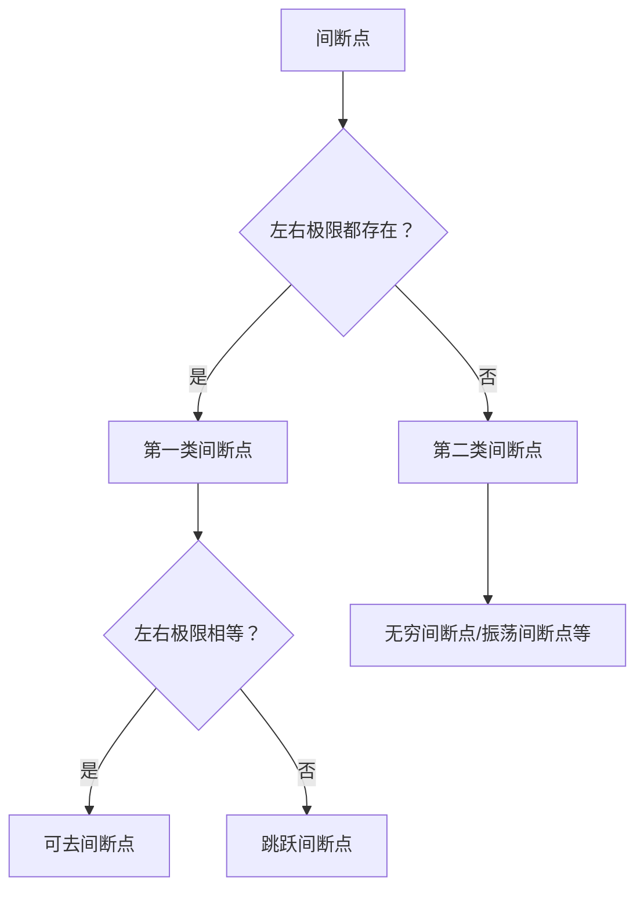

# 高等数学 — 函数、极限、连续

> **考情提示**：高等数学占数一总分约 56%（≈84 分），是考研数学的绝对主力。本章（函数极限连续）是整门课的地基——选择题每年 1–2 题（4–8 分），极限计算更是后续微分积分的必备基本功。重点：极限计算（等价无穷小、洛必达、泰勒展开、夹逼定理）、间断点分类、连续性与介值定理。

## 函数

### 函数的基本概念

**函数** $y = f(x)$ 是将定义域 $D$ 中的每个 $x$ 唯一映射到值域 $R$ 中一个 $y$ 的对应关系。数一考查的主要函数类型：

- **初等函数**：幂函数 $x^\alpha$、指数函数 $a^x$、对数函数 $\log_a x$、三角函数、反三角函数以及它们的复合运算
- **分段函数**：在定义域不同区间用不同表达式表示——典型如绝对值函数 $|x|$
- **隐函数**：由方程 $F(x,y)=0$ 确定的函数关系，未必能写为 $y=f(x)$ 的显式
- **参数方程函数**：$\begin{cases} x=\phi(t) \\ y=\psi(t) \end{cases}$，常见于曲线运动描述

### 函数的特性

- **有界性**：若存在 $M>0$ 使得 $|f(x)| \leq M$ 对所有 $x$ 成立，则 $f(x)$ 有界
- **单调性**：$x_1 < x_2 \Rightarrow f(x_1) \leq f(x_2)$（单调增）或 $\geq$（单调减）
- **奇偶性**：$f(-x) = -f(x)$ 是奇函数（关于原点对称）；$f(-x) = f(x)$ 是偶函数（关于 $y$ 轴对称）
- **周期性**：存在 $T>0$ 使得 $f(x+T) = f(x)$ 恒成立——三角函数是典型周期函数

## 极限

### 极限的定义

数列极限的 **ε-N 语言**：

> $\lim\limits_{n \to \infty} x_n = A \iff \forall \varepsilon > 0,\ \exists N \in \mathbb{N},\ \text{当}\ n > N\ \text{时恒有}\ |x_n - A| < \varepsilon$

函数极限的 **ε-δ 语言**：

> $\lim\limits_{x \to x_0} f(x) = A \iff \forall \varepsilon > 0,\ \exists \delta > 0,\ \text{当}\ 0 < |x-x_0| < \delta\ \text{时恒有}\ |f(x)-A| < \varepsilon$

> 💀 408 考卷大概率不需要默写 ε-δ 定义，但理解其含义对于选项判断（特别是「极限是否存在」的判断）至关重要。

### 极限的计算方法

极限计算是数一最核心的基本功，六大方法之间存在优先级路线：

| 优先级 | 方法 | 适用场景 |
|:--:|------|------|
| 1 | **等价无穷小替换** | 乘除中的 $0/0$ 型，$\sin x \sim x$、$\tan x \sim x$、$\ln(1+x) \sim x$、$e^x-1 \sim x$、$1-\cos x \sim \frac{1}{2}x^2$ 等 |
| 2 | **两个重要极限** | ① $\lim\limits_{x\to 0} \frac{\sin x}{x} = 1$ ② $\lim\limits_{x\to \infty} (1+\frac{1}{x})^x = e$ |
| 3 | **洛必达法则** | $\frac{0}{0}$ 或 $\frac{\infty}{\infty}$ 未定式——分子分母分别求导再取极限 |
| 4 | **泰勒展开** | 复杂函数在某点的局部近似——如 $e^x = 1+x+\frac{x^2}{2!}+\cdots$ |
| 5 | **夹逼定理** | 无法直接算但函数夹在两个已知极限相同的函数之间 |
| 6 | **单调有界准则** | 证明极限存在（常用于递推数列），再解出极限值 |

> 做题优先先用等价无穷小简化，简完再上洛必达或泰勒展开。

**两个重要极限**（必背）：

$$
\lim_{x \to 0} \frac{\sin x}{x} = 1 \qquad\qquad 
\lim_{n \to \infty} \left(1 + \frac{1}{n}\right)^n = e
$$

**无穷小的比较**：

- 若 $\lim \frac{\alpha(x)}{\beta(x)} = 0$，称 $\alpha$ 是 $\beta$ 的**高阶无穷小**，记作 $\alpha = o(\beta)$
- 若 $\lim \frac{\alpha(x)}{\beta(x)} = c \neq 0$，称 $\alpha$ 与 $\beta$ **同阶无穷小**
- 若 $\lim \frac{\alpha(x)}{\beta(x)} = 1$，称 $\alpha$ 与 $\beta$ 是**等价无穷小**，记作 $\alpha \sim \beta$

## 连续

### 连续的定义

函数 $f(x)$ 在点 $x_0$ 处**连续**的充要条件：

$$
\lim_{x \to x_0} f(x) = f(x_0)
$$

即：① $f(x_0)$ 有定义 ② 极限存在 ③ 极限值 = 函数值。三个条件缺一不可。

### 间断点的分类

- **可去间断点**：左右极限都存在且相等，但函数值不等于该极限值（或函数未定义）。加上一句「若补充定义 $f(x_0) = \lim_{x \to x_0} f(x)$」即可去除
- **跳跃间断点**：左右极限都存在但不相等——不能通过修改一点消除
- **第二类间断点**：至少一侧极限不存在——如无穷阶（$f(x) \to \infty$）或振荡型（$\sin\frac{1}{x}$ 在 $x=0$ 附近无穷次振荡）

### 闭区间上连续函数的性质

- **有界性定理**：若 $f(x)$ 在 $[a,b]$ 上连续，则 $f(x)$ 在 $[a,b]$ 上有界
- **最值定理**：连续函数在闭区间上必取到最大值和最小值
- **介值定理**：若 $f(a) \cdot f(b) < 0$，则 $\exists \xi \in (a,b)$ 使 $f(\xi) = 0$（零点定理是特例）

> 选择题常见结论：**初等函数在定义域区间内处处连续**。只要不跨越断点（如分母为零点、对数 0 点），初等函数必连续。

## 常见题型

- **极限计算**（必考）：分式求极限（等价无穷小 + 洛必达）、$1^\infty$ 型（取对数或重要极限公式）
- **无穷小阶的比较**：选择题给出两个无穷小问高低阶关系
- **间断点分类**：给分段函数，指出间断点是第几类，能否去
- **介值定理/零点定理证明**：构造辅助函数 $F(x)$，证明方程在给定区间有根
- **连续性的概念判断**：利用极限值 = 函数值，反解参数条件
